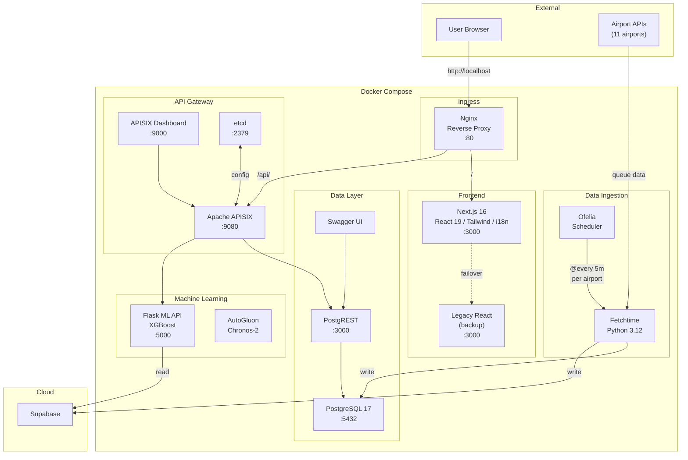

# Waitport - Airport Security Queue Predictions

[](https://github.com/simonottosen/cph-security/blob/main/LICENSE)
[](https://www.codefactor.io/repository/github/simonottosen/cph-security)

Waitport monitors real-time security queue wait times and provides ML-based predictions for 11 European airports. Queue data is collected every 5 minutes, stored in PostgreSQL (and mirrored to Supabase), and used to train per-airport XGBoost models that predict future queue lengths.

### Supported Airports

| Code | City | Country |
|------|------|---------|
| CPH | Copenhagen | Denmark |
| FRA | Frankfurt | Germany |
| ARN | Stockholm Arlanda | Sweden |
| OSL | Oslo | Norway |
| DUS | Dusseldorf | Germany |
| AMS | Amsterdam Schiphol | Netherlands |
| DUB | Dublin | Ireland |
| LHR | London Heathrow | United Kingdom |
| MUC | Munich | Germany |
| EDI | Edinburgh | United Kingdom |
| IST | Istanbul | Turkey |

## Architecture



## Tech Stack

| Layer | Technologies |
|-------|-------------|
| **Frontend** | Next.js 16, React 19, TypeScript, Tailwind CSS 4, Recharts 3, Headless UI, i18n (en/da/de) |
| **Backend** | Python 3.12, Flask, PostgREST |
| **ML** | XGBoost 3.0, scikit-learn 1.7, AutoGluon, Chronos-2, holidays |
| **Database** | PostgreSQL 17, Supabase (cloud mirror) |
| **API Gateway** | Apache APISIX, etcd |
| **Infrastructure** | Docker Compose (13 services), Nginx, Ofelia scheduler, GitHub Actions CI/CD, GHCR |

## Getting Started

### Prerequisites

- Docker and Docker Compose
- A Google Firebase service account key (`keyfile.json`) for the data fetching service
- Supabase project URL and service role key (for ML API training data)

### Environment Setup

The `.env` file in the repository root contains all required configuration. Key variables:

| Variable | Description |
|----------|-------------|
| `POSTGRES_PASSWORD`, `POSTGRES_DB`, `POSTGRES_USER` | PostgreSQL credentials |
| `GCP_KEY_PATH` | Path to your Firebase `keyfile.json` |
| `SUPABASE_URL`, `SUPABASE_SERVICE_ROLE_KEY` | Supabase connection details |
| `CPHAPI_HOST` | Internal PostgREST endpoint |
| `*_HEALTHCHECK` | Healthcheck ping URLs per airport (CPH, FRA, ARN, etc.) |

### Deployment

```bash
docker compose up -d
```

Once running, access the frontend at [http://localhost](http://localhost) (port 80 via Nginx).

## Services

| Service | Image | Purpose | Exposed Port |
|---------|-------|---------|-------------|
| `cph_postgres_db` | `postgres:17` | Primary database | - |
| `cph_frontend_nextjs` | `ghcr.io/.../cph-security_nextjs:main` | Next.js frontend (primary) | - |
| `cph_frontend_nextgen` | `ghcr.io/.../cph-security_frontend-nextgen:main` | Legacy React frontend (backup) | - |
| `reverse-proxy` | `nginx:alpine` | Reverse proxy and load balancer | **80** |
| `cph_postgrest` | `postgrest/postgrest` | Auto-generated REST API from PostgreSQL | - |
| `swagger-ui` | `swaggerapi/swagger-ui` | Interactive API documentation | - |
| `universal_fetchtime` | `ghcr.io/.../cph-security_fetchtime:main` | Scheduled data collection from airport APIs | - |
| `ofelia_scheduler` | `mcuadros/ofelia` | Cron-like scheduler for fetchtime jobs | - |
| `apisix` | `apache/apisix` | API gateway | **9080** |
| `apisix_dashboard` | `apache/apisix-dashboard` | APISIX management UI | **9000** |
| `etcd` | `bitnamilegacy/etcd` | APISIX configuration store | 2379 |
| `ml_api` | `ghcr.io/.../cph-security_ml_api:main` | XGBoost prediction API | **5000** |
| `autogluon` | `ghcr.io/.../cph-security_autogluon:latest` | Chronos-2 time-series forecasting | - |

## Ofelia Scheduler

[Ofelia](https://github.com/mcuadros/ofelia) orchestrates the data collection jobs, running a fetch command for each airport every 5 minutes:

```yaml
labels:
  ofelia.enabled: "true"
  ofelia.job-exec.cph.schedule: "@every 5m"
  ofelia.job-exec.cph.command: "cph-fetch"
  ofelia.job-exec.fra.schedule: "@every 5m"
  ofelia.job-exec.fra.command: "fra-fetch"
  # ... repeated for all 11 airports
```

## API Usage

The API is powered by [PostgREST](https://postgrest.org), which generates a RESTful API directly from the PostgreSQL schema. Requests are routed through Nginx and APISIX.

**Get all waiting times:**
```
GET /api/v1/waitingtime
```

**Get times with queue less than 4 minutes:**
```
GET /api/v1/waitingtime?queue=lt.4
```

**Get only queue and timestamp columns:**
```
GET /api/v1/waitingtime?select=queue,timestamp
```

**Get the latest waiting time:**
```
GET /api/v1/waitingtime?select=queue&order=id.desc&limit=1
```

### ML Prediction Endpoint

The ML API provides queue length predictions:

```
GET /predict?airport=CPH&timestamp=2026-03-14T08:00
```

**Parameters:**
- `airport` - Airport code (one of: AMS, ARN, CPH, DUB, DUS, FRA, IST, LHR, EDI, MUC)
- `timestamp` - Future datetime in UTC (format: `YYYY-MM-DDTHH:MM`)

**Response:**
```json
{"predicted_queue_length_minutes": 12.5}
```

## API Documentation

PostgREST uses the [OpenAPI](https://openapis.org/) standard to generate API documentation, consumed by Swagger UI. The Swagger UI container provides an interactive interface to explore and test the API endpoints.

## ML Predictions

The system uses two ML approaches:

**XGBoost (primary)** - Per-airport gradient-boosted models trained on historical queue data. Features include:
- Time-of-day, day-of-week, month
- Local public holidays (per country)
- Rolling averages and lag features
- Models retrain daily at midnight via Flask-Crontab

**AutoGluon / Chronos-2** - Time-series forecasting using Amazon's Chronos-2 foundation model for complementary predictions.

Both services read training data from Supabase and serve predictions via REST endpoints.

## Internationalization (i18n)

The frontend supports three languages:
- English (`en`)
- Danish (`da`)
- German (`de`)

Locale files are located in `waitport/src/locales/` and the app automatically detects the user's preferred language from browser settings and URL path segments.

## CI/CD

Five GitHub Actions workflows automate builds and security scanning:

| Workflow | Trigger | Action |
|----------|---------|--------|
| `frontend_nextjs.yml` | Changes to `waitport/` | Build and push Next.js image to GHCR |
| `fetchtime.yml` | Changes to `fetchtime/` | Run tests, build and push image to GHCR |
| `ml_api.yml` | Changes to `ml_api/` | Build and push ML API image to GHCR |
| `autogluon.yml` | Changes to `autogluon/` | Build and push AutoGluon image to GHCR |
| `codeql.yml` | Scheduled / on push | Code security analysis |

All production images are hosted on GitHub Container Registry (`ghcr.io/simonottosen/cph-security_*`).

## Project Structure

```
cph-security/
├── waitport/              # Next.js frontend (React 19, Tailwind, i18n)
├── fetchtime/             # Data collection service (Python 3.12)
├── ml_api/                # XGBoost prediction API (Flask)
├── autogluon/             # Chronos-2 forecasting service
├── nextflight/            # Flight data service
├── database/              # PostgreSQL schema (create_tables.sql)
├── config/
│   ├── reverse_proxy/     # Nginx configuration
│   ├── apisix_conf/       # APISIX gateway configuration
│   └── apisix_dashboard_conf/
├── .github/workflows/     # CI/CD pipelines
└── docker-compose.yml     # Service orchestration (13 services)
```

## License

This project is licensed under the MIT License - see the [LICENSE](LICENSE) file for details.
